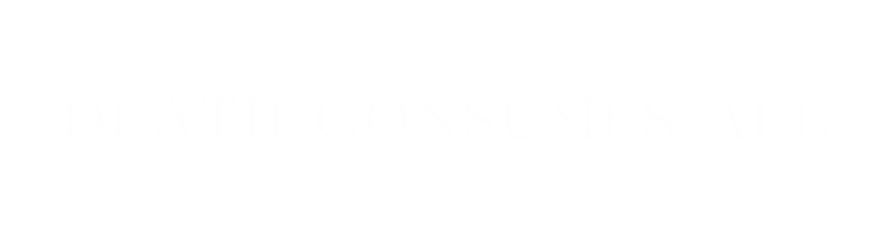

# DEATH CONSUMES ALL

Döden är vardag i Himmelfjord vars mest kända plats är dess stora kyrkogård. Det är nästan så att överallt man går så blir man påmind om döden, då många butiker och restauranger passat på att döpa sig till något morbidt för att locka in de nyfikna turister som vallfärdar från hela världen till stadens kända kyrkogård. "Death Cove", "Forgotten Nest" och "InkBlood" är alla namn på verksamheter man kan tänkas passera när man går längs gatan.

För de flesta i Himmelfjord är det inte särskilt konstigt. Himmelfjord har en rik historia och trots den mängden turister som kyrkogården lockar så är det inte något anmärkningsvärt för de vana invånarna i staden.

På dagarna är Himmelfjord som vilken annan norsk stad som helst. De allra flesta jobbar med fiske eller driver någon form av verksamhet och alldeles utanför staden så finns det många jobbmöjligheter i kärnkraftverket som förser många av städerna norr om Norge med energi.

Nätterna är däremot något som alltid varit fylld med kontrovers. Många journalister, författare och spökjägar-amatörer har dragit sig till de mystiska nätterna som plågar Himmelfjord. Allt ifrån mystiska ljud och ljus till helt och hållet brutala mord - som sopas under mattan - är det som folket i Himmelfjord står ut med. Staden är delad i sina åsikter, då många anser att det bara är vidskepelse och det är vargar som orsakar det mesta, medan andra är helt medvetna om att det är något mer övernaturligt so drabbar staden. För vissa är det inte ett mysterium då de vet exakt vad det är som pågår då de med största sannolikhet deltar i det.

Din historia börjar här. I Himmelfjord. Den norska staden där döden är lika vardaglig som att gå på pubben en fredag kväll. Vare sig du är lyckligt ovetandes, en skeptiker eller en del av fenomen som pågår i Himmelfjord, det är upp till dig.

## Ont vs Gott

Tanken är inte att förse sidan med en kamp mellan svart & vitt, istället är allt en kamp om grått, där alla varelser är en del av balansen i världen.
